# Fault Injection and Anomaly Detection


___
<!-- 2. [Fault Injection](#fault_injection) -->

1. [Goal of the Project](#project_goal)
2. [Creating the Datasets](#create_dataset)
3. [Anomaly detection with tensorflow with Python](#anomaly_detection)
4. [Use the trained model weights in C++](#model_weights)
5. [Run the C++ file on ROS](#ros)
___
## <a id ="project_goal"></a> 1. Goal of the project

Being given a constant flow of images viewed from a car mounted camera, if something abnormal is happening, can it be detected and cataloged as anomalous?

In order to answer this question two separate datasets were created. One that has normal/ clean data and the other one containing the anomalous/ noisy data. In order to create the normal data, Prescan will be used, and, to inject faulty images, Simulink and Matlab will be utilized. Then, for data processing and model implementation, Python will be the main programming language, with two approaches being taken into consideration:
- autoencoders, where the dataset is decomposed in smaller dimensions and then reconstructed in order to "understand" how the normal/clean data looks like. Therefore, anything but the clean data will be labeled as being anomalous.
- supervised learning, where the dataset is labeled containg both clean and abnormal data, and the model is built using Convolutional Neural Networks


Autoencoders | Convolutional Neural Networks
:---:|:---:
 | 

The trained weights will be converted in C++ and the model evaluation will be done in C++. Finally, in order for an intelligent car to make use of the written code, the entire project will be run in a ROS environment. 
___
 ## <a id="create_dataset"></a>2. Creating the datasets

#### Clean data
For data generation I have used a custom built Prescan model, in which the world consists of several buildings and pedestrians viewed from the perspective of a front view camera mounted on a normal car and follows a predifined path. To make the data more real, I have added road signs and other cars participating in the traffic. The video that was made can be visualized below. 

Prescan Image | Prescan Video
:------:|:------:
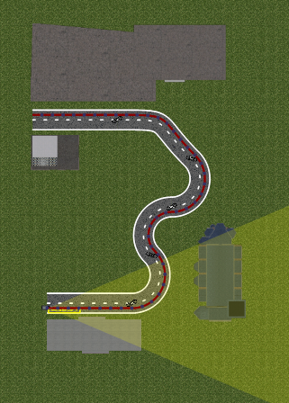 | 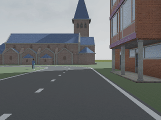


#### Fault Injection

To the images gathered by this camera a gaussian noise is applied, thus injecting the fault. Therefore, I have created a custom Matlab function, which being given the RGB channels from the camera and the parameters standard deviation and mean, would apply the gaussian noise on the initial data. By increasing the mean the brightness increases and by increasing the standard deviation the noise level increases. The results can be visualized below. 

Simulink Block | Anomalous Data
:---:|:---:
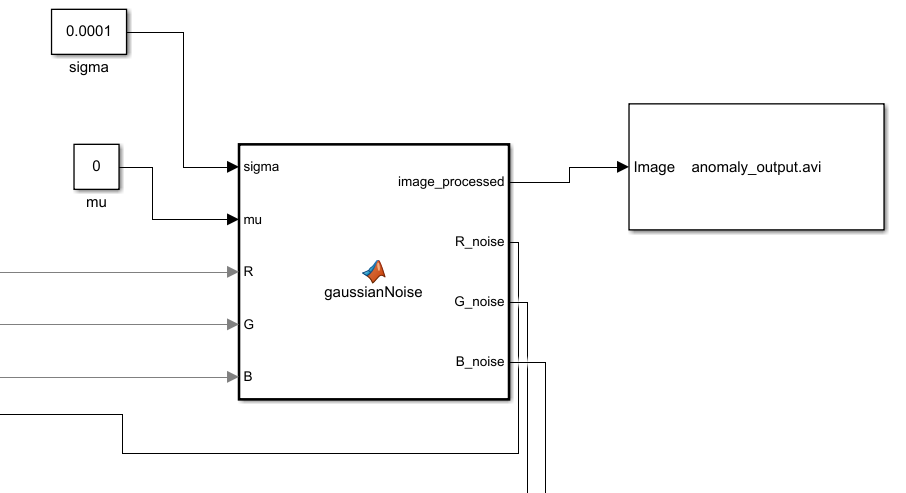|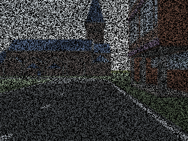

Thus, the gaussian noise is applied on each of the RGB channels, the results being concatenated to form the anomalous data. The code used to generate this noise is presented as follows. 

```matlab
function [image_processed, R_noise, G_noise, B_noise] = gaussianNoise(sigma, mu, R, G, B)

[size_1_img, size_2_img] = size(R) ;
gaussian_noise = mu + uint8(abs(floor(randn(size_1_img, size_2_img) * sigma))) ;

R_noise = R .* gaussian_noise;
G_noise = G .* gaussian_noise;
B_noise = B .* gaussian_noise;

image_processed = cat(3, R_noise, G_noise, B_noise) ;
```
The required videos can be found in Experiments -> SimpleExperiment. That's the folder where both the clean_output.avi and anomalous_output.avi are.
___
## <a id="anomaly_detection"></a>3. Anomaly detection with tensorflow with Python

#### Data processing 

With respect to the data processing part, there is a common part, 
where each video is split by frame. Thus, the normal data has  221 images and the anomalous data has 161 images. Each image is resized in a specific format (the chosen one being 128 x 128). Bigger images will imply more time for processing, with small to no performance improvent. Smaller images would imply loss in information that will worsen the prediction. All images where normalized in the [0, 1] interval for easier use and faster computations.

Since two methods are being considered, some processing had to be made specifically for that approach. Therefore:
- Autoencoder: images were grayscale, as RGB images will worsen the predictions
- CNN: data augmentation was highly needed since the initial dataset had only 382 images, more data was created by rotating the images and by randomly flipping an image


#### Model implementation

##### A. Autoencoder


The autoencoder model consists of two parts, which are called in sequence:
- The encoder, where the dimensionality of the data is reduced and is composed of
    - one input layer, having the dimension of the initial data
    - and two conv2d layers, both with leaky relu as activation function, having a 3x3 kernel and strides = 2, the first one being of size 256 and the second one of size 128
- The decoder, where the image is reconstructed, with
    - two conv2dtranspose layers having the same structure of 3x3 kernel, strides=2 and leaky relu as activation function
    - and one output layer being given the number of output channels, in this case 1, and sigmoid as an activation function

```python
class AnomalyDetector(Model):
    def __init__(self, image_size, hidden_layer_1, hidden_layer_2, channels):
        super(AnomalyDetector, self).__init__()
        self.image_size = image_size
        self.hidden_layer_1 = hidden_layer_1
        self.hidden_layer_2 = hidden_layer_2
        self.channels = channels

        self.encoder = tf.keras.Sequential([
            tf.keras.layers.InputLayer(input_shape = (image_size, image_size, channels)),
            tf.keras.layers.Conv2D(hidden_layer_1, (3, 3), padding = 'same', strides = 2), 
            tf.keras.layers.LeakyReLU(),
            tf.keras.layers.Conv2D(hidden_layer_2, (3, 3), padding = 'same', strides = 2), 
            tf.keras.layers.LeakyReLU(), 
        ])

        self.decoder = tf.keras.Sequential([
            tf.keras.layers.Conv2DTranspose(hidden_layer_2, kernel_size=3, padding = 'same', strides = 2), 
            tf.keras.layers.LeakyReLU(),
            tf.keras.layers.Conv2DTranspose(hidden_layer_1, kernel_size=3, padding = 'same', strides = 2),
            tf.keras.layers.LeakyReLU(),
            tf.keras.layers.Conv2DTranspose(channels, 3, padding = 'same', activation = 'sigmoid'),
        ])

    def get_config(self):
        config = {
        "image_size": self.image_size, 
        "hidden_layer_1": self.hidden_layer_1,
        "hidden_layer_2": self.hidden_layer_2,
        "channels": self.channels
        }
        return config 

    def call(self, x):
        encoded = self.encoder(x)
        decoded = self.decoder(encoded)
        return decoded
```

With respect to training the autoencoder, the following hyperparameters were used: 
- Epochs = 10, // number of times the model will be trained using 
- Batch_size = 8, // number of images fed at once to be trained
- Hidden_layer_1 = 256, // no of neurons in the first layer
- Hiddent_layer_2 = 128,  // no of neurons in the second layer
- Optimizer = ‘adam’ // optimization technique to reach the global minimum (difference between what it’s predicted and what it should predict)
- Metrics = ‘mse’ // mean squared error since the data consists of values between 0 and 1
- Loss = SSIMLoss // loss function that takes into account the structural similarly, in terms of luminance, contrast and structure. A value of 1 would indicate identical images, so, it’s calculated as 1 - SSIMLoss, which needs to be as close as possible to 0

Being given the above described parameters, the model clearly performs excellent in terms of training, reducing the loss with each iteration. The graph presented below also shows that both the training and validation losses are constantly decreasing. 

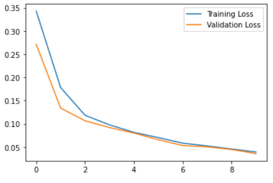

```python
Epoch 1/10
22/22 [==============================] - 15s 647ms/step - loss: 0.3429 - mse: 0.0247 - val_loss: 0.2715 - val_mse: 0.0157
Epoch 2/10
22/22 [==============================] - 14s 636ms/step - loss: 0.1782 - mse: 0.0065 - val_loss: 0.1339 - val_mse: 0.0018
Epoch 3/10
22/22 [==============================] - 14s 653ms/step - loss: 0.1184 - mse: 0.0018 - val_loss: 0.1065 - val_mse: 0.0016
Epoch 4/10
22/22 [==============================] - 14s 645ms/step - loss: 0.0978 - mse: 0.0016 - val_loss: 0.0920 - val_mse: 0.0013
Epoch 5/10
22/22 [==============================] - 14s 644ms/step - loss: 0.0817 - mse: 0.0012 - val_loss: 0.0802 - val_mse: 0.0013
Epoch 6/10
22/22 [==============================] - 14s 636ms/step - loss: 0.0703 - mse: 0.0010 - val_loss: 0.0657 - val_mse: 9.4617e-04
Epoch 7/10
22/22 [==============================] - 14s 634ms/step - loss: 0.0584 - mse: 8.7248e-04 - val_loss: 0.0532 - val_mse: 8.3311e-04
Epoch 8/10
22/22 [==============================] - 15s 665ms/step - loss: 0.0524 - mse: 8.8492e-04 - val_loss: 0.0506 - val_mse: 8.6172e-04
Epoch 9/10
22/22 [==============================] - 14s 643ms/step - loss: 0.0457 - mse: 8.2360e-04 - val_loss: 0.0448 - val_mse: 9.1828e-04
Epoch 10/10
22/22 [==============================] - 14s 655ms/step - loss: 0.0393 - mse: 6.7595e-04 - val_loss: 0.0358 - val_mse: 6.2813e-04
```

Two different performance evaluation methods are taken into account. The first one is represented by the SSIMloss. By looking at the image belw, the first row corresponds to a clean image, the second row corresponds to its reconstruction, the third row an anomalous image and the fourth row to its reconstruction. While evaluating the loss, the original image is always compared to its reconstruction. Thus, the second and fourth row will have a value different than 0. It can be observed that the reconstruction for the clean data has a very low loss (under 0.1), while the reconstruction of the anomalous data has a high loss, over 0.45. Even though a human eye could not easily see the difference between the original image and its reconstruction, this evaluation method is capable of observing the contrast, the luminance and other structural disimilarities. By setting the evaluating threshold as the minimum loss value of the reconstructed anomalous data, we can perfectly categorize the two types of data and therefore identify all the anomalies.

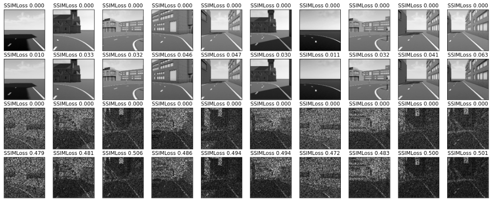

The second method to evaluate the autoencoder’s performance is by calculating the distribution of the losses, taking its mean and adding 2 standard deviations and setting that value as a threshold. With this method it manages to differentiate very well, but not as good as the previous method as somoe of the clean data is considered anomalous. 

Loss Distribution | Setting Threshold
:---:|:---:
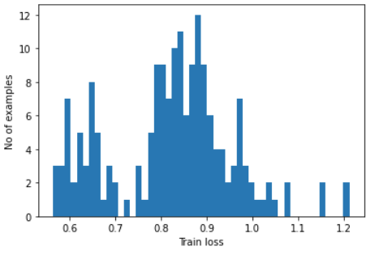 | 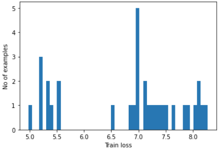


##### B. Classification:

For this approach, the dataset was split into 70% train, 20% test and 10% validation and images were kept in the RGB format. The processing part earlier described was done in the training part, where a random flip is initiated to the original image and a random rotation with a factor of 0.2 is also applied. 

The structure of the model is presented as follows: 
- an input layer, with the dimensions of the initial images
- 2 conv2d layers of size 8 and 4 respectively, having 3x3 kernel size, strides = 2 and RelU activation function
- 2 maxpooling2d layers, 
- a flatten layer, 
- a dense layer of size 16, 
- and an output layer having 1 value with activation sigmoid, since we are dealing with differentiating two different classes

Note: the RandomFlip and RandomRotation layers were eliminated from the C++ implementation, as the experimental layers were not supported by the frugally-deep library. 

```python
supervised_model = tf.keras.Sequential([
    # tf.keras.layers.experimental.preprocessing.RandomFlip(),
    # tf.keras.layers.experimental.preprocessing.RandomRotation(0.2),
    tf.keras.layers.InputLayer(input_shape=(
        image_size, image_size, channels)),
    tf.keras.layers.Conv2D(hidden_convlayer_1, 3,
                            padding='same', strides=2, activation='relu'),
    tf.keras.layers.MaxPooling2D(),
    tf.keras.layers.Conv2D(hidden_convlayer_2, 3,
                            padding='same', strides=2, activation='relu'),
    tf.keras.layers.MaxPooling2D(),
    tf.keras.layers.Flatten(),
    tf.keras.layers.Dense(hidden_denselayer_3, activation='relu'),
    tf.keras.layers.Dense(1, activation='sigmoid')
])
```
Loss | Accuracy
:---:|:---:
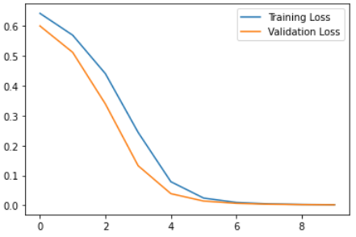 |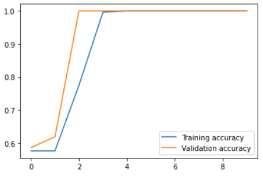


##### Results 

|        |       precision   | recall | f1-score   |support |
|--------|-----------------|---------|------|---------------|
|          0.0      | 1.00    |  1.00     |1.00    |     13 |
|          1.0   |    1.00   |   1.00   |   1.00   |     10 |
|                                                           |
|     accuracy       |    |        |        1.00   |     23 |
|    macro avg       |1.00 |     1.00   |  1.00    |     23 |
| weighted avg     |  1.00  |    1.00  |    1.00   |     23 |


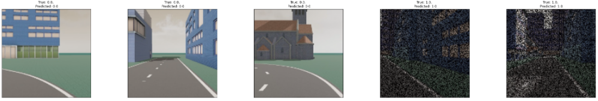

##### Models comparison 

- autoencoders: the model trains for around 2 minutes, even though there are only 221 images fed into it, which implies that with more data the training period will increase exponentially. However, the very low train and validation loss, suggests that the model is very capable of detecting the anomalies and labeling them accordingly. 
- CNN: the model trains very fast, so if more data were to be fed, it will not have such a great impact on the training period. This procedure is very fast and very accurate, however, the only downside, which is also a very important one, is that it learns how to distinguish the clean data from the data with the gaussian noise. If I were to give a different type of noise it will raise errors, as it will not know in which category it belongs to. However, achieving 100% accuracy implies that further research is needed in order to investigate weather the data is very easy to differentiate, or the model is overfitting.

##### Conclusion

- autoencoder manages to differentiate any kind of anomaly from the clean normal data
- CNN manages to differentiate the clean data from the gaussian noise one only.
___
## <a id="model_weights"></a>4. Use the trained model weights in C++

In order to convert the Python trained weights into C++, the [frugally-deep](https://github.com/Dobiasd/frugally-deep) library was used. During the instalation, other depeneding libraries were needed, which can be found in the includes file within each c++ folder. However, the fully conversion couldn't be made right away, as some changes were needed. First of all, the frugally-deep library does not support Conv2DTranspose layer, but as identified in their documentation, it can be replaced by an UpSampling2D() layer followed by a Conv2D layer. Nevertheless, the strides had to be eliminated, in order for the dimension to be kept correctly. Furthermore, the frugally-deep library works only with Sequential layers, therefore custom classes will not work. Thus, I had to change the AnomalyDetection class presented into the autoencoder description, in the following code: 

```python
model_new = tf.keras.Sequential([
            tf.keras.layers.InputLayer(input_shape = (image_size, image_size, channels)),
            tf.keras.layers.Conv2D(hidden_layer_1, (3, 3), padding = 'same', strides = 2), 
            tf.keras.layers.LeakyReLU(),
            tf.keras.layers.Conv2D(hidden_layer_2, (3, 3), padding = 'same', strides = 2), 
            tf.keras.layers.LeakyReLU(),
            tf.keras.layers.UpSampling2D((2,2)),
            tf.keras.layers.Conv2D(hidden_layer_2, (3, 3), padding = 'same', strides = 2),
            tf.keras.layers.LeakyReLU(),
            tf.keras.layers.UpSampling2D((2,2)),
            tf.keras.layers.Conv2D(hidden_layer_1, (3, 3), padding = 'same'),
            tf.keras.layers.LeakyReLU(),
            tf.keras.layers.UpSampling2D((2,2)),
            tf.keras.layers.Conv2D(channels, (3, 3), padding = 'same', activation = 'sigmoid'),
])
```

With respect to the CNN, only the experimental layers concerning the data augmentation part had to be eliminated, everythin else remains the same. The weights for both models were saved as a ".h5" file and can be found in the models folder.

An extra change had to be made in the function that converts the weights (convert_model.py with the keras_export subfolder). As I am using a custom loss function (SSIM loss), when loading the model, the ```compile = False``` parameter needs to be added, in order not to compile the model again which would avoid the usage of the custom function, and thus avoiding errors. 

An example to convert the autoencoders weights are presented as follows. Note, the conversion for the CNN is done in a similar manner.
- train in python the sequential model,
- go to > tensorflow conversion > frugally-deep-master > keras_export, then run
```python
python convert_model.py /home/adeye/AD-EYE_Core/AD-EYE/Anomaly_Detection/models/autoencoder/autoencoder_sequential.h5 /home/adeye/AD-EYE_Core/AD-EYE/Anomaly_Detection/models/autoencoder/autoencoder_sequential.json
```

During the C++ model evaluation, each image was read, resized with the correct dimensions (128 x 128),  transformed into a tensor and then finally used for predictions. For the autoencoders, an extra step had to be made, consisting of transforming the tensors back to images in order to call the SSIM loss function. A C++ implementation of the SSIM function was used and linked to the project and can be found [here](https://github.com/fran6co/background_estimation/tree/master/segmenter)

In order to run the C++ file, one needs to follow these steps (this is for the autoencoder, the corresponding file for the CNN is frugally-deep-supervised, and the executable is ```./supervised```):

- go to the frugally-deep-trial > build
- type ```cmake ..``` followed by ```make``` and lastly ```./frugally``` 

The CMakeLists.txt files need to be linked to the OpenCV library, the CMAKE standard had to be 14, the path to the additional needed libraries for frugally-deep and the OpenCV_LIBS had to be given, and lastly the directories paths of the mentioned libraries and the binary directory had to be specified. The tutorial used to convert Python weights into C++ can be found [here](https://m-shaeri.ir/blog/tensorflow-keras-train-in-python-predict-use-in-c-plus/)
___
## <a id="ros"></a>5. Run the C++ file on ROS

In order to create the ros environment nodes and packages, the following lines had to be written. Note: I faced some issues with ```catkin_make```, so ```catkin build``` was used instead.  
```
mkdir -p catkin_anomaly/src
cd catkin_anomaly
catkin build

cd src
catkin_create_pkg autoencoder stdmsg rospy roscpp
catkin_create_pkg supervised stdmsg rospy roscpp
cd ..
catkin build
```

After placing the C++ files in the corresponding subfolders, some changes were needed for the CMakeLists.txt files. Catkin library had to be added with find_package having  the required components: roscpp, rospy and std_msg, then the path to the includes file had to be changed in the target_link_libraries as they are stored differently. In the same place catkin_LIBRARIES had to be added also. The include_directories had to have the catkin_INCLUDE_DIRS, while the exported targets for both the project and the catkin had to be added in the add_dependencies.  

After all these changes were made, in one terminal, one has to write ```roscore```, while in another terminal, one has to write the following lines
```
cd catkin_anomaly
catkin build
source devel/setup.bash
rosrun autoencoder autoencoder
```
or equivalently

```
rosrun supervised supervised
```
___

#### Requirements

These libraries and packages are needed for Python 3.8 conda environment
```
conda install matplotlib
conda install sckit-learn
conda install tensorflow (check to be version 2.6)
conda install pandas
conda install numpy
conda isntall -c conda-forge imutils


pip install pipreqs
pip install opencv-python
```
___

#### Folder Structure

```
📦Anomaly_Detection
 ┣ 📂.ipynb_checkpoints                                     
 ┣ 📂.vscode        
 ┃ ┗ 📜settings.json
 ┣ 📂Tensorflow Conversion                          # folder to include frugally-deep and dependencies
 ┃ ┣ 📂frugally-deep-master                         # main conversion library 
 ┃ ┃ ┣ 📂include
 ┃ ┃ ┃ ┗ 📂fdeep
 ┃ ┃ ┣ 📂keras_export
 ┃ ┃ ┃ ┣ 📜convert_model.py                         # file used to convert the trained weights of the model
 ┃ ┃ ┃ ┣ 📜generate_test_models.py
 ┃ ┃ ┃ ┣ 📜model_new.json
 ┃ ┃ ┃ ┣ 📜save_application_examples.py
 ┃ ┃ ┃ ┗ 📜visualize_layers.py
 ┃ ┃ ┣ 📂logo
 ┃ ┃ ┗ 📂test
 ┃ ┗ 📂includes
 ┣ 📂anomaly_cpp                                    # failed attenpt to convert tensorflow model in pytorch c++
 ┃ ┣ 📂build
 ┃ ┣ 📜CMakeLists.txt
 ┃ ┣ 📜anomaly.cpp
 ┃ ┗ 📜download_mnist.py
 ┣ 📂catkin_anomaly                                 # ROS environement where both models can be run (autoencoder and CNN)
 ┃ ┣ 📂.catkin_tools
 ┃ ┣ 📂build
 ┃ ┣ 📂devel
 ┃ ┣ 📂logs
 ┃ ┗ 📂src
 ┃ ┃ ┣ 📂autoencoder
 ┃ ┃ ┃ ┣ 📂include
 ┃ ┃ ┃ ┃ ┗ 📂autoencoder
 ┃ ┃ ┃ ┣ 📂src
 ┃ ┃ ┃ ┃ ┣ 📂needed_includes                        # libraries and dependencies to run the code
 ┃ ┃ ┃ ┃ ┣ 📜autoencoder.cpp
 ┃ ┃ ┃ ┃ ┣ 📜ssim.cpp                               # SSIM loss function implemented in C++
 ┃ ┃ ┃ ┃ ┗ 📜ssim.h
 ┃ ┃ ┃ ┣ 📜CMakeLists.txt
 ┃ ┃ ┃ ┗ 📜package.xml
 ┃ ┃ ┗ 📂supervised
 ┃ ┃ ┃ ┣ 📂include
 ┃ ┃ ┃ ┃ ┗ 📂supervised
 ┃ ┃ ┃ ┣ 📂src
 ┃ ┃ ┃ ┃ ┣ 📂needed_includes
 ┃ ┃ ┃ ┃ ┗ 📜supervised.cpp
 ┃ ┃ ┃ ┣ 📜CMakeLists.txt
 ┃ ┃ ┃ ┗ 📜package.xml
 ┣ 📂cmake_tutorial                                 # CMake tutorial file where basic library addition were tried out
 ┃ ┣ 📂MathFunctions
 ┃ ┃ ┣ 📜CMakeLists.txt
 ┃ ┃ ┣ 📜MathFunctions.h
 ┃ ┃ ┗ 📜mysqrt.cxx
 ┃ ┣ 📂build
 ┃ ┣ 📜CMakeLists.txt
 ┃ ┣ 📜TutorialConfig.h.in
 ┃ ┗ 📜tutorial.cpp
 ┣ 📂dataset                                        # Main folder for the dataset
 ┃ ┣ 📂anomaly_images
 ┃ ┗ 📂images
 ┣ 📂frugally-deep trial                            # autoencoder C++ impementation
 ┃ ┣ 📂build
 ┃ ┣ 📂includes
 ┃ ┣ 📜CMakeLists.txt
 ┃ ┣ 📜main.cpp
 ┃ ┣ 📜ssim.cpp
 ┃ ┗ 📜ssim.h
 ┣ 📂frugally-deep-supervised                       # CNN C++ implementation
 ┃ ┣ 📂build
 ┃ ┣ 📂includes
 ┃ ┣ 📜CMakeLists.txt
 ┃ ┗ 📜main_supervised.cpp
 ┣ 📂models                                         # Model weights saved in Python for both models
 ┃ ┣ 📂autoencoder
 ┃ ┃ ┣ 📂assets
 ┃ ┃ ┣ 📂variables
 ┃ ┃ ┃ ┣ 📜variables.data-00000-of-00001
 ┃ ┃ ┃ ┗ 📜variables.index
 ┃ ┃ ┣ 📜autoencoder.h5
 ┃ ┃ ┣ 📜autoencoder_sequential.h5
 ┃ ┃ ┣ 📜autoencoder_sequential.json
 ┃ ┃ ┣ 📜keras_metadata.pb
 ┃ ┃ ┣ 📜model_new.h5
 ┃ ┃ ┗ 📜saved_model.pb
 ┃ ┗ 📂supervised_model
 ┃ ┃ ┣ 📂assets
 ┃ ┃ ┣ 📂variables
 ┃ ┃ ┃ ┣ 📜variables.data-00000-of-00001
 ┃ ┃ ┃ ┗ 📜variables.index
 ┃ ┃ ┣ 📜keras_metadata.pb
 ┃ ┃ ┣ 📜saved_model.pb
 ┃ ┃ ┣ 📜supervised_model.h5
 ┃ ┃ ┗ 📜supervised_model.json
 ┣ 📂readme_images                                  # Images used for readme.md file
 ┣ 📂version_cpp                                    # MNIST C++ PyTorch implementation 
 ┃ ┣ 📂build
 ┃ ┣ 📂libtorch
 ┃ ┣ 📜CMakeLists.txt
 ┃ ┣ 📜download_mnist.py
 ┃ ┗ 📜main_test.cpp
 ┣ 📜README.md
 ┣ 📜ad_22032022.ipynb                              # main ipynb containing data processing visualization training etc
 ┣ 📜ad_22032022.py
 ┣ 📜autoencoder.py                                 # alternative to train autoencoder model, not to be used for C++ conversion
 ┣ 📜dataset.py
 ┣ 📜default-a6cf411d-7560-4962-aa42-b79cddfd3a60.ipynb
 ┣ 📜environment.yml                                # conda freeze, but not useful
 ┣ 📜requirements.txt                               # created using pipreqs, just informative, not to be used, install manually
 ┣ 📜requirements_freeze.txt                        # created unsig pip freeze, not useful
 ┗ 📜supervised.py                                  # alternative to train CNN model, not to be used for C++ conversion
```
<!-- need to include snippets of codes, clean the folders add images + instructions on how to use it. it's gonna take some time. -->
