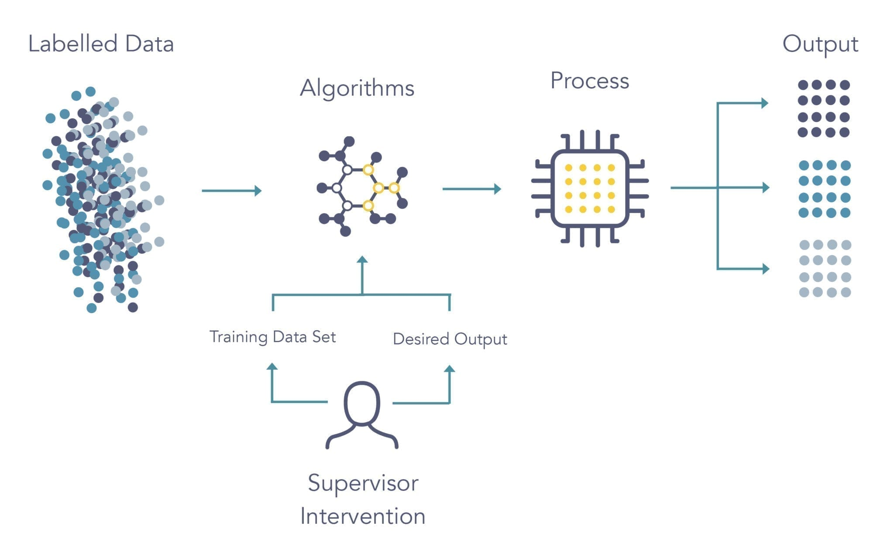

# Fault Injection and Anomaly Detection

___

1. [Create the dataset](#create_dataset)
2. [Fault Injection](#fault_injection)
3. [Anomaly detection with tensorflow with Python](#anomaly_detection)
4. [Use the trained model weights in C++](#model_weights)
5. [Run the C++ file on ROS](#ros)

___
## <a id="create_dataset"></a>1. Create the dataset

#### Data gathering
For data generation I have used a custom build Prescan model, in which the world consists of several buildings and pedestrians viewed from the perspective of a camera mounted on a normal car. 


The world that I built is rather simple, and it consists of a car that has a front view camera, and follows a predefined path. To make the data more real, I have added pedestrians, buildings, road signs and other cars participating in the traffic. 


Having that said, 2 separate datasets were formed:
One that has the normal/clean data
The other one containing the anomalous/ noisy data
The goal of the project is that being given a constant flow of images, if something abnormal is happening, can it be detected and cataloged as anomalous ?
The proposed solution implies two distinct methods:
Autoencoder. Where the data is decomposed in smaller dimensions and then reconstructed in order to “learn” how clean/normal data looks like
Show image of an autoencoder
Classification. Being given a dataset composed of both normal and anomalous data, each with the corresponding label, build a ml algorithm that manages to correctly differentiate them.
Show image of classification
Data processing 
With respect to the data processing part, there is a common part, 
where each video is split by frame
Thus, the normal data has  221 images and the anomalous data has 161 images
Each image is resized in a specific format (the chosen one being 128 x 128)
Bigger images will imply more time for processing, with almost no improvement performance
Smaller images would imply loss in information that will worsen the prediction 
All images where normalized in the [0, 1] interval for easier use and faster computing power
Since two approaches are made, some processing had to be made specifically for that approach. Therefore:
Autoencoder: images were grayscale
Classification: data augmentation was highly needed since the initial dataset had only 382 images, more data was created by rotating the images and by randomly flipping an image


___
## <a id="fault_injection"></a>2. Fault Injection


To the images gathered by this camera a gaussian noise is applied, thus injecting the fault. The parameters that I have used to generate the gaussian noise are standard deviation: and mean: . The code used to generate this noise can be visualized below  By increasing the mean the brightness increases and by increasing the standard deviation the noise level increases


```matlab
function [image_processed, R_noise, G_noise, B_noise] = gaussianNoise(sigma, mu, R, G, B)

[size_1_img, size_2_img] = size(R) ;
gaussian_noise = mu + uint8(abs(floor(randn(size_1_img, size_2_img) * sigma))) ;

R_noise = R .* gaussian_noise;
G_noise = G .* gaussian_noise;
B_noise = B .* gaussian_noise;

image_processed = cat(3, R_noise, G_noise, B_noise) ;
```
___
## <a id="anomaly_detection"></a>3. Anomaly detection with tensorflow with Python

Model implementation
Autoencoder


The autoencoder model consists of two parts:
 the encoder, where the dimensionality of the data is reduced
One input layer 
and 2 conv2d layers, both with leaky relu as activation function, having a 3x3 kernel and strides = 2 of size 256 and 128 respectively
The decoder, where the image is reconstructed
2 conv2dtranspose layers having the same structure of 3x3 kernel, strides=2 and leaky relu as activation function
One output layer being given the number of output channels, in this case 2, and sigmoid as an activation function, since we are dealing with differentiating a class from another
By calling them in a sequence, the model was finally built
The next part consists of training the model:
The chosen hyper parameters are:
Epochs = 10, // number of times the model will be trained using 
Batch_size = 8, // number of images fed at once to be trained
Hidden_layer_1 = 256, // no of neurons in the first layer
Hiddent_layer_2 = 128,  // no of neurons in the second layer
Optimizer = ‘adam’ // optimization technique to reach the global minimum (difference between what it’s predicted and what it should predict)
Metrics = ‘mse’ // mean squared error since the data consists of values between 0 and 1
Loss = SSIMLoss // loss function that takes into account the structural similarly, in terms of luminance, contrast and structure. A value of 1 would indicate identical images, so, it’s calculated as 1 - SSIMLoss, which needs to be as close as possible to 0
Being given the above described parameters, the model clearly performs excellent in terms of training, reducing the loss with each iteration. The graph also shows that both the training and validation losses are decreasing reaching a maximum slope after 4 iterations
Two different performance evaluation methods are taken into account. 
First is using the SSIMloss. By looking at the following image, the first row corresponds to a clean image, the second row corresponds to it’s reconstruction, the third row an anomalous image and the fourth row it’s reconstruction. As it can be seen, while evaluating the loss, we always compare the original image with its reconstruction. Thus, the second and fourth row will have a value different than 0. It can be observed that the reconstruction for the clean data has a very low loss (under 0.1), while the reconstruction of the anomalous data has a high loss, over 0.45. 
By evaluating the losses taking the minimum loss value of the reconstructed anomalous data, we can perfectly categorize the two types of data
The second method to evaluate the autoencoder’s performance is by calculating the distribution of the losses, taking its mean and adding 2 standard deviations and setting that value as a threshold. 
With this method it manages to differentiate very well, but not as good as the previous method
Classification:

For this approach, the dataset was split into 70% train, 20% test and 10% validation and images were kept in the RGB format. 
The processing part earlier described was done in the training part, where a random flip is initiated to the original image and a random rotation with a factor of 0.2 is also applied
It consists of:
 an input layer,
 2 conv2d layers, 
 2 maxpooling2d layers, 
a flatten layer, 
a dense layer 
and an output layer   

Models comparison 
Results 
Conclusion

___
## <a id="model_weights"></a>4. Use the trained model weights in C++

- used frugally deep library
- used other libraries that frugally deep depended on (can be found in the includes files)
- opencv to read the images
- tensor from bytes
- predict output based on input
- from tensor to cv::Mat
- call the SSIM loss function
- !!!!!! important: in the convert_model.py file I have changed the load_model function to have ```python compile=False``` as parameter !!!! Because I am using a custom loss function, the parameter was necesarry for avoiding to call the loss function in C++ which would be cumbersome.  

___
## <a id="ros"></a>5. Run the C++ file on ROS

mkdir -p catkin_ws/src
cd catkin_ws
catkin build

cd src
catkin_create_pkg autoencoder stdmsg rospy roscpp
catkin_create_pkg supervised stdmsg rospy roscpp
cd ..
catkin build

cd

19.05
Re-did the ros tutorial for the 3rd time
Managed to make talker - listener working
Managed to make simple hello world working
Reflections:
Catkin_make did not create the necessary “include” files, but catkin build solved the issue
In the tutorial ros in trello, the points 9 and 10 are not put, which are essential for the C++ version. (we have to create the msg and srv files, which are created automatically in python)
I cannot run the full tutorial now, I think I changed something within the computer. Runnin rosrun rqt_graph rqt_graph, raises eros such as PyQt5 module is not installed. If I try to install it, it says it is already installed. Yes, I deactivated conda and checked if everything is installed, and indeed it is, so I have no idea what’s wrong    

20.05
Managed to make the mnist working on ros
Reflections: 
Same problem as yesterday, catkin_make didn’t work, but catkin build did the trick
$(PROJECT_NAME) in the CMakeLists.txt within the local folder, had to be changed to a predefined variable, different than the project name (idk why, it should have worked with it, since it should have taken the new project name)
Had to put the libtorch file also in the catkin ws, maybe it works without it. I have to check if it works without libtorch being in the same folder. 
These had to be included in the ros CMakeLists.txt
find_package(catkin REQUIRED COMPONENTS
 roscpp
 rospy
 std_msgs
)
 
catkin_package()
 
include_directories(
 ${catkin_INCLUDE_DIRS}
)
 target_link_libraries and add_dependancies have to take into consideration both torch and catkin
target_link_libraries (main_test
"${TORCH_LIBRARIES}"
${catkin_LIBRARIES}
)
set_property (TARGET main_test PROPERTY CXX_STANDARD 14)
add_dependencies(main_test ${${PROJECT_NAME}_EXPORTED_TARGETS} ${catkin_EXPORTED_TARGETS})
 
 


For mnist_tutorial, there was a problem with the path of the dataset in the the main_test.cpp file (it stores the data differently in a ros environment) 
Managed to translate some tensorflow python to pytorch c++, but it is not working :(

02.06

Found a VAE implemented in C++ that might be useful: https://github.com/AD2605/Variational-Autoencoder/blob/master/Autoencoder.cpp
For some reason I can’t link the pytorch lib to another destination path other than version_cpp/ libtorch
I changed the cmakefiles path to another one and does not work
Have the same dataset error, but I couldn't find any solution now, even though I repeated the above steps.
I was running rosrun mnist_tutorial mnist_tutorial, because I thought that the project name has to be the one that needs to be running, I should have been running rosrun mnist_tutorial main_test, which is the name of the file that I want to run. *facepalm
Regarding the anomaly detection model, there is something wrong with the input dimensions of the model
I’ll try with the found variational autoencoder

03.06
I found a library that would transfer tensorflow trained models from python into C++ deployment. https://github.com/Dobiasd/frugally-deep. However, there are two problems that make it incompatible to this project:
It does not support custom models, and there are a lot of workarounds that need to be made, which will take a lot of time
After long tries to create some workarounds however, I have re-read the documentation and apparently, it does not support Conv2DTranspose layer (*facepalm again), which are the essential layers in the autoencoder. However, I’m gonna leave the link to the found tutorial here just in case. https://m-shaeri.ir/blog/tensorflow-keras-train-in-python-predict-use-in-c-plus/
Managed to change the custom model to fit the requirements of the library (preserving as best as possible results, even though the new one performs a bit worse than the original)
Managed to create a json file that could be read and called using C++

09.06
In the morning I continued with the tutorial, trying to load the libraries. Since the guy is using Windows and can just import them with just 2 clicks, I have to create CMakeLists.txt files. It was going very slowly, and at the end of the day I googled for some tutorials. 
In the afternoon, I worked on the presentation

10.06
Followed the CMakeLists.txt tutorials. 
With a bit of struggle, I was finally able to load the libraries, with no errors. Next step is to start loading the weights and install openCV for C++ to read the images and process them a bit, in order to be tested.   

15.06
Found a usable ssim loss implementation: https://github.com/fran6co/background_estimation/tree/master/segmenter 
Got filesystem library working -> solution #include <experimental/filesystem> instead of #include <filesystem> 
Added opencv to the project and to the CMakeLists.txt file
 
target_link_libraries(frugally PUBLIC ${OpenCV_LIBS})
include_directories(${OpenCV_INCLUDE_DIRS})
Added ssim.cpp file in the CMakeLists.txt file 
add_executable(frugally main.cpp ssim.cpp)
Successfully loaded the model
Managed to read and resize the images (tip: for the reading part, the filesystem library doesnt work, but I used the cv::glob to get all the path images in a vector and then used a for to read each image)
Managed to convert images in tensors
Managed to predict the images
Managed to convert tensors in images (tip: for the shapes part, it’s tensor.front().shape() not tensor.shape(), because the output is defined as an “internal tensor” after using predict, not a normal tensor) 
Managed to calculate the loss between the initial image and the reconstructed one
Managed to calculate the ssim loss for both clean and anomalous data, and it’s working as expected (low values for clean data, high values for anomalous data).
Current CMakeLists.txt file: 
```cmake
cmake_minimum_required(VERSION 3.5 FATAL_ERROR)
project(frugally)
 
find_package(OpenCV REQUIRED)
set (CMAKE_CXX_STANDARD 14)
set(CMAKE_CXX_STANDARD_REQUIRED True)
 
add_executable(frugally main.cpp ssim.cpp)
target_link_libraries(frugally PUBLIC ${PROJECT_SOURCE_DIR}/includes)
 
 
target_link_libraries(frugally PUBLIC ${OpenCV_LIBS})
include_directories(${OpenCV_INCLUDE_DIRS})
 
target_include_directories(frugally PUBLIC
                           "${PROJECT_BINARY_DIR}"
                           "${PROJECT_SOURCE_DIR}/includes"
 
)
 ```
 

Conclusion: miracles do happen 
Todo: retrain the model with higher resolution images
Clean folders
Add things to git and .gitignore
Add the supervised model as well
Run it on ros


16.06
Retrained the model with dim 128 x 128, but it’s very slow while testing using C++ (approx 6.5 sec per image tested)
Current workflow: train in python the sequential model, in terminal go to the current folder > tensorflow conversion > frugally-deep-master > keras_export, then run  
```python
python convert_model.py /home/adeye/AD-EYE_Core/AD-EYE/Anomaly_Detection/models/autoencoder/autoencoder_sequential.h5 /home/adeye/AD-EYE_Core/AD-EYE/Anomaly_Detection/models/autoencoder/autoencoder_sequential.json
```

, then go to the frugally-deep-trial > build, then type ```cmake ..``` followed by ```make``` and lastly ```./frugally```
For the supervised learning model the RandomFlip and RandomRotation are not implemented because in previous versions of tensorflow, they are implemented in the experimental layers, which are not supported by the deep library…. => in order to make it work, I have to delete those layers.
Managed to get both autoencoder and supervised model running on ros environment


___

Other stuff: 

Complete project overview:

Built a simulation world using Prescan
Inject a fault using Simulink and Matlab
Apply various ML algorithm on detecting the faults with Python
Transfer the trained model from Python to C++ for faster computations and deployment and run it on ROS

Building a simulation using prescan:

The world that I built is rather simple, and it consists of a car that has a front view camera, and follows a predefined path. To make the data more real, I have added pedestrians, buildings, road signs and other cars participating in the traffic. 
This is a sample of the created video. 

Inject a fault using Simulink and Matlab
The next step was to inject some sort of fault in the camera, in order to create the anomalous data. The chosen one was a gaussian noise, with user defined parameters, and the anomalous data looks like this in the end. 
ML part:
Now, the goal of my project is to detect anomalies, so the basic principle is to build a machine learning algorithm that learns the clean data, and in the case that a anomalous data is being fed into the system, it will raise an error saying that the data is anomalous. The objective is to detect any kind of anomaly, not just the gaussian one, as I have created it, but I used it in order to test the model's performance.
Therefore I have used two techniques to differentiate the clean data from the anomalos one, the first one is autoencoder. What it does, it basically just shrings the data in a very low dimensional plane and then it reconstructs it. This way, it manages to learn the particularities of the clean data. By using a SSIM loss, which stands for Sturcutral Similarity in images and takes into account brightness, structures and contours, I was able to distinguish clean data from anomalous one

The first row represents the clean data, and then the second row represents it's reconstruction. As it can be seen the value of the SSIM loss for the reconstruction is very low in each case. However, the 3rd row represents the anomalous data, and the 4th row represents it's reconstruction. Even if for the naked eye it might be very hard to observe the dissimilarities in the reconstruction, using that specific loss, I obtained high values, which indicates that the data is anomalous. 

The second method used, is a supervised learning one, meaning that we know beforehand which data is clean and which is anomalous. This procedure is very fast and very accurate, however, the only downside, which is also a very important one, is that it learns how to distinguish the clean data from the data with the gaussian noice. If I were to give a different type of noise it will raise errors, as it will not know in which category it belongs to. 


Remaining tasks:
Transfer the model weights in C++ so that they could be used in a ROS environment, I have been trying to do that in the past month, but I have only managed to do the ros tutorial, and make a mnist nn work on ros. And I've been struggling for the past weeks to find some relevant tutorial that would help me use the weight that I've already stored using Python in C++


<!-- need to include snippets of codes, clean the folders add images + instructions on how to use it. it's gonna take some time. -->
